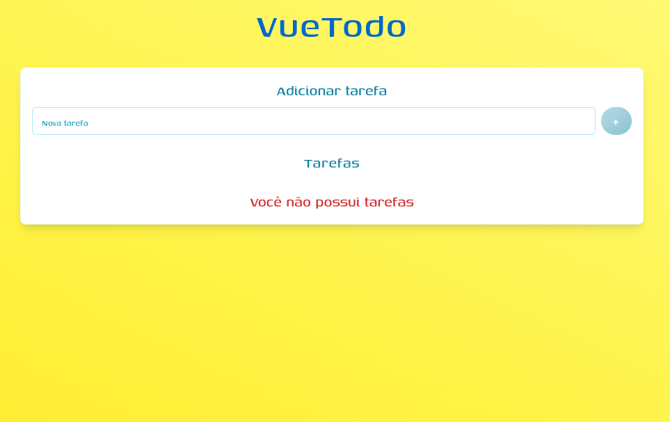

<div align="center">
  
</div>

<div align="center">

# **VueTodo**

</div>

<div align="center">
  
</div>

---

## **Sobre o Projeto**

Uma aplicação desenvolvida em **Vuejs** e **TypeScript**, que aborda conceitos avançados de desenvolvimento frontend, incluindo:

- **[TypeScript](https://www.typescriptlang.org/):** Tipagens avançadas.
- **[ViteJS](https://vitejs.dev/):** Bundler para gerenciamento eficiente da aplicação.
- **[TailwindCSS](https://tailwindcss.com/):** Framework declarativo para estilização.
- **[Vuejs](https://vuejs.org/):** Framework frontend.

---

## **Requisitos**

Antes de rodar a aplicação, certifique-se de ter instalado:

- Um editor de código (como [Visual Studio Code](https://code.visualstudio.com/)).
- [Node.js](https://nodejs.org/en/) para gerenciar o ambiente de execução.
- [Git Bash](https://gitforwindows.org/) ou outro terminal para clonar o repositório e instalar dependências.

---

## **Como Rodar o Projeto**

Siga os passos abaixo para configurar e executar o projeto:

1. Clone o repositório:

   ```bash
   git clone https://github.com/Ricnaga/vuetodo
   ```

2. Acesse o diretório do projeto:

   ```bash
   cd vuetodo
   ```

3. Instale as dependências:

   ```bash
   yarn
   # ou
   npm install
   ```

4. Inicie a aplicação:

   ```
   yarn dev
   # ou
   npm run dev
   ```

5. Acesse no navegador:

   O projeto estará disponível em http://localhost:5173.
